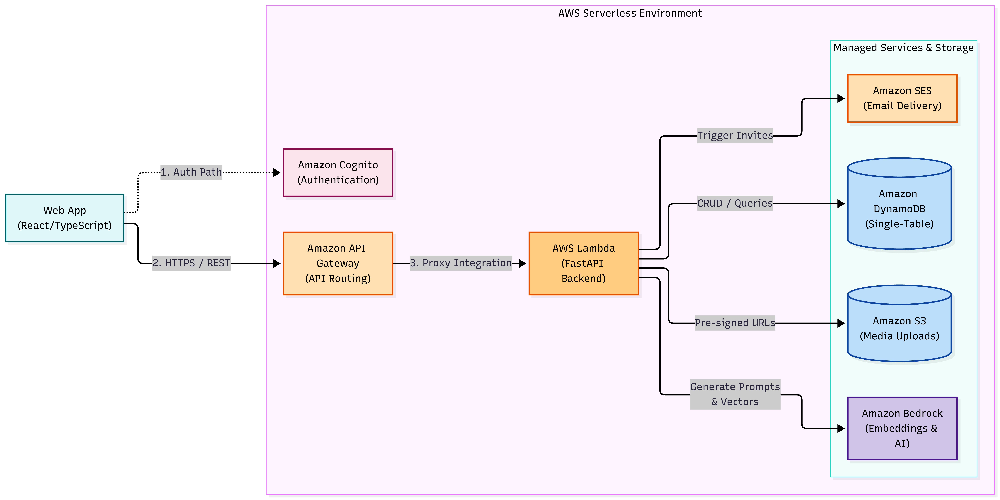
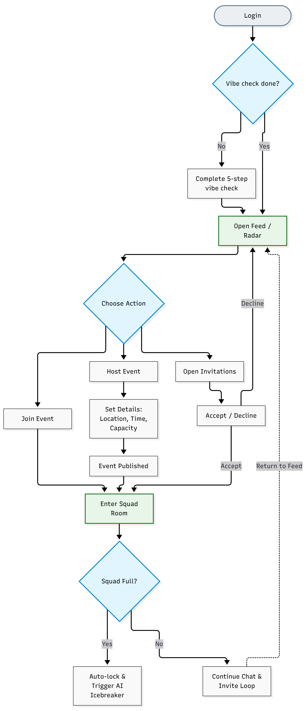

# FOMO

FOMO is a campus social app for discovering and joining small, spontaneous student events. It combines a React frontend with a FastAPI backend and can run locally without AWS credentials using mock mode.

## System Architecture

### AWS Serverless Architecture
API Gateway receives requests from the React frontend and invokes a FastAPI application on AWS Lambda via Mangum. Lambda interacts with DynamoDB for single-table persistence, S3 for media storage, SES for email invitations, and Bedrock for embeddings and icebreakers.



### User Onboarding and Event Flow
1. **Onboarding & Embedding**: Students complete a 5-step qualitative vibe check. Amazon Bedrock (`amazon.titan-embed-text-v2:0`) computes a 512-dimensional vector stored in DynamoDB.
2. **Event Creation**: A host publishes an event with location, time, and capacity. The event description is embedded via Bedrock, and email invitations are sent via Amazon SES.
3. **Feed Ranking**: Active events within campus radius (Haversine formula) are ranked against the student's vibe vector using cosine similarity.


### Event Vibe Check Pipeline
State flow from authentication to locked squad:
- Users without an existing profile complete the 5-step questionnaire.
- Users view the ranked feed, accept/decline invitations, or host an event.
- When an event reaches member capacity, it transitions to `CREW_LOCKED`. Amazon Bedrock (`anthropic.claude-3-haiku`) generates a conversation starter based on member profiles.



## Project structure

- `frontend/` - React + Vite + Tailwind web app
- `backend/` - FastAPI API, services, and tests
- `infra/` - AWS SAM template for cloud deployment
- `docs/architecture/` - System and workflow diagrams
- `scripts/` - helper scripts for demo data and API checks

## Tech stack

- Frontend: React 18, TypeScript, Vite, Tailwind CSS, Leaflet
- Backend: Python 3.12, FastAPI, Uvicorn, Pydantic, Mangum
- Cloud services: AWS Lambda, API Gateway, DynamoDB, S3, SES, Bedrock
- Infrastructure as code: AWS SAM

## Local development

### 1) Start the backend

```bash
cd backend
pip install -r requirements.txt
python -m uvicorn app.local_server:app --reload --port 8000
```

Notes:
- Local backend defaults to `USE_MOCK_AWS=true`, so it works without AWS credentials.
- API base URL is `http://localhost:8000`.

### 2) Start the frontend

```bash
cd frontend
npm install
npm run dev
```

The frontend runs on `http://localhost:5173` by default.

### 3) Seed demo data (optional)

```bash
python scripts/seed_demo_data.py --url http://localhost:8000
```

### 4) Verify core API flows (optional)

```bash
python scripts/verify_endpoints.py --url http://localhost:8000
```

## Frontend scripts

From `frontend/`:

- `npm run dev` - start dev server
- `npm run build` - type-check and build production assets
- `npm run lint` - run ESLint
- `npm run preview` - preview production build

## Backend tests

From `backend/`:

```bash
pytest
```

## API overview

Base URL: `http://localhost:8000`

### Auth
- `POST /api/auth/demo-login`
- `POST /api/auth/reset-demo-db`

### Vibe and upload
- `POST /api/vibe-check`
- `GET /api/upload-url`

### Events
- `POST /api/events`
- `GET /api/events/feed`
- `GET /api/feed` (alias of events feed)
- `GET /api/events/{eventId}`
- `POST /api/events/{eventId}/join`
- `POST /api/events/{eventId}/leave`
- `DELETE /api/events/{eventId}?hostId=...`
- `GET /api/events/{eventId}/messages`
- `POST /api/events/{eventId}/messages`

### Invitations
- `GET /api/invitations/pending?email=...`
- `GET /api/invitations/sent/recent`
- `GET /api/invitations/{inviteId}`
- `POST /api/invitations/{inviteId}/accept`
- `POST /api/invitations/{inviteId}/decline`
- `POST /api/invitations/send`

## AWS deployment

```bash
sam build --template-file infra/template.yaml
sam deploy --guided
```

The SAM template provisions:
- HTTP API + Lambda backend
- DynamoDB table (`FOMOEngine`)
- S3 media bucket
- Cognito user pool and client
- IAM permissions for DynamoDB, S3, SES, and Bedrock
